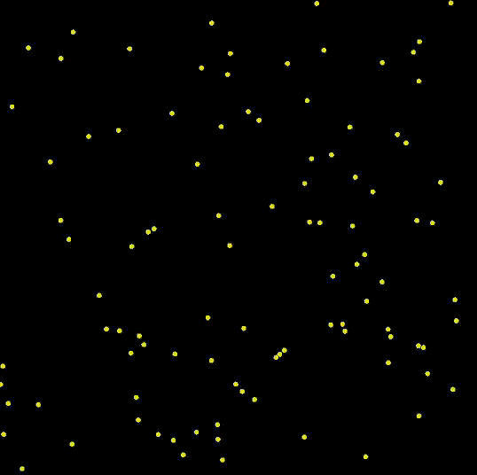

# Particle System Optimisation

A real-time 2D particle physics simulation written in **C++** using **OpenGL** and **GLFW**, featuring multiple balls with elastic collisions, wall interactions, and configurable visual styling.

---

## Demo




---

## Features

- Real-time rendering with **OpenGL**
- Multiple independently moving balls
- **Elastic and inelastic particle collisions** using a coefficient of restitution
- Accurate **ball–ball collision resolution** with positional correction
- **Wall collision handling** within normalized device coordinates
- Configurable colours, ball count, and physics parameters
- Live **FPS counter** printed to the console

---

## Physics Overview

Each ball is modeled with:
- Position `(x, y)`
- Velocity `(vx, vy)`
- Radius
- Optional acceleration

The simulation includes:
- **Particle–particle collisions** using normal and tangential velocity decomposition
- **Wall collisions** with velocity inversion
- Overlap correction to prevent sticking
- Equal-mass collision assumptions

---

## Controls

There is no user input required.  
The simulation starts automatically when the program is run.

---

## Configuration

Key parameters can be adjusted at the top of the source file:

```cpp
const int NUM_BALLS = 10;
const float RESTITUTION = 0.9f;
const float MIN_BALL_RADIUS = 0.01f;
const float MAX_BALL_RADIUS = 0.01f;
```

You can also modify:

- Background colour
- Ball colours
- Border thickness
- Window size

---

# Build and Run

## Dependencies:
- C++17 or later
- OpenGL
- GLFW

## Comple (Linux/macOS)
```bash
./run.sh
```
---
## Rendering Details
- Circles are rendered using triangle fans with configurable segment counts

- Each ball is drawn with a thin border for visual clarity

- Rendering is done in normalized device coordinates using:
```cpp
    glOrtho(-1, 1, -1, 1, -1, 1);
```
- Colours are selected from a predefined colour map for easy customization
- Immediate-mode OpenGL is used for simplicity and clarity

---

# Future Improvements
- Add gravity and configurable acceleration

- Support variable ball masses

- Introduce user interaction (mouse and keyboard controls)

- Implement spatial partitioning for improved performance

- Add UI controls for runtime parameter tuning
