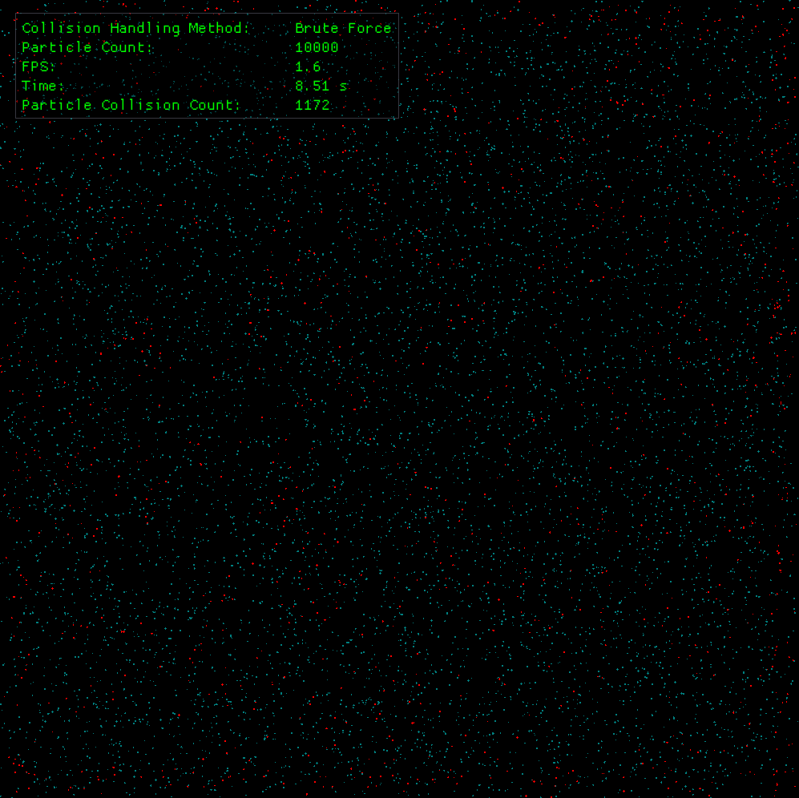
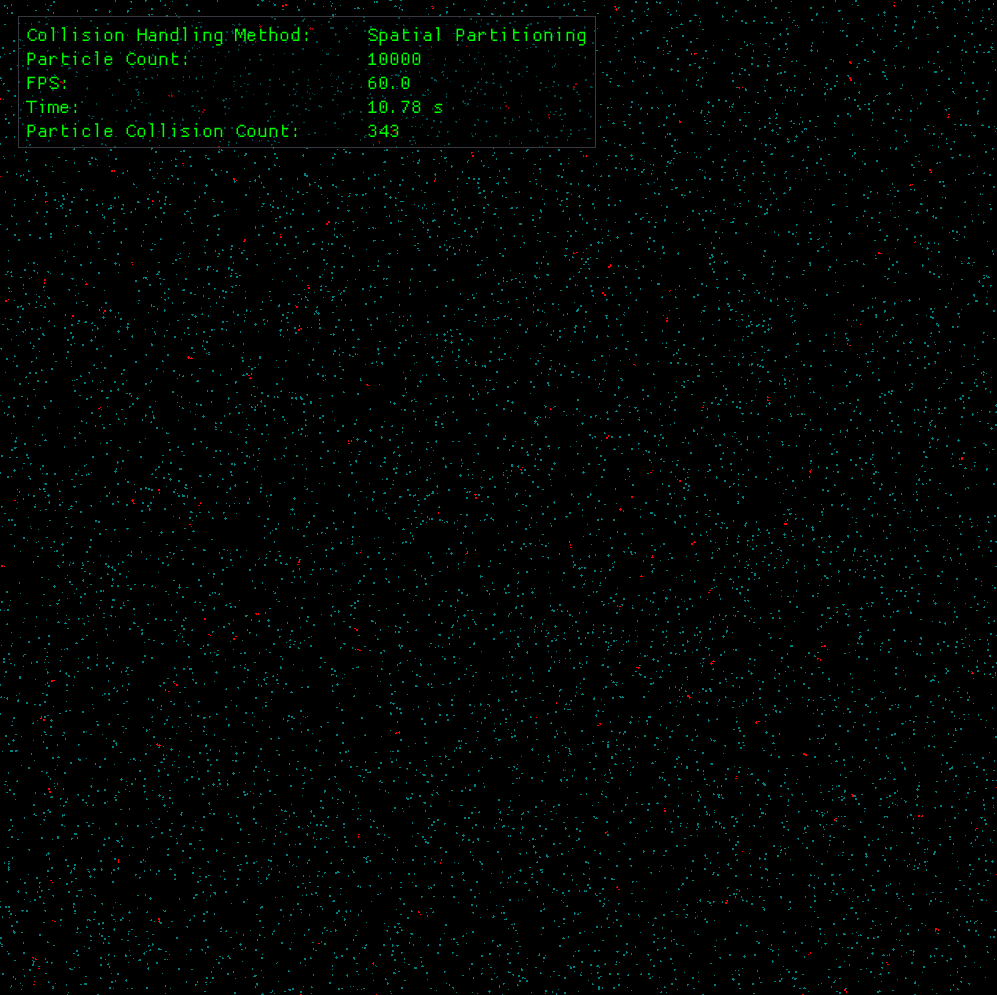

# 2D Particle Collision Simulation

This project is a high-performance **2D particle collision simulation** written in modern C++ using **OpenGL** and **GLFW**. It simulates thousands of particles with real-time rendering and demonstrates advanced physics and optimization techniques such as spatial partitioning and multithreaded frame encoding.

---

## Collision Detection Strategies

### Brute Force
The simulation includes a naive **O(n²)** implementation where every particle is checked against every other particle. This is primarily used as a baseline for performance comparison.

<p align="center">
  
</p>

---

### Spatial Partitioning
To handle large-scale simulations (up to **30,000 particles**), the project implements a **grid-based spatial partitioning** system. This reduces computational complexity to approximately **O(n)** for evenly distributed particles.

<p align="center">
  
</p>

---

## Core Functionality

*   **Real-Time Simulation Engine (`ParticleSystem.cpp`)**: This module manages the life cycle of particles, including their movement, boundary logic, and inter-particle interactions.
*   **Visual Rendering (`Utils.cpp`)**: Particles are rendered as circles using `GL_TRIANGLE_FAN` primitives. The system dynamically updates particle colors to visually represent active collisions.
*   **Live Diagnostics (`Logging.cpp`)**: This file implements an **ImGui** overlay that provides a real-time "HUD" showing the current collision method, particle count, frames per second (FPS), and the number of particles currently colliding.
*   **Multithreaded Recording (`Recorder.cpp`)**: To prevent expensive image encoding from slowing down the simulation, this module uses a dedicated background thread to save frames captured from the GPU.
*   **Recording & Export Tool (`RecordingTool.cpp`)**: Provides a user interface to start recordings and allows the user to choose between **MP4** or **GIF** exports via FFmpeg pipelines.
*   **Application Framework (`main.cpp`)**: Orchestrates the primary execution loop, manages delta time, and synchronizes the physics updates with the rendering and recording tools.

---

## Technical Highlights

### Uniform Grid Spatial Partitioning
The optimized `ParticleSystem_V2` divides the simulation world into a grid of cells. Instead of testing every particle pair, each particle only checks for collisions within its own cell and the eight adjacent cells. The grid is rebuilt every frame to reflect the current positions of all particles.

### Elastic Collision Resolution
Particle interactions are resolved using **vector projection** onto normal and tangent vectors.
*   **Velocity Exchange**: Velocity components along the collision normal are swapped between particles to produce realistic equal-mass elastic collisions.
*   **Positional Correction**: To prevent particles from "sticking" together due to numerical overlap, a correction step pushes particles apart until they are just touching.

### Multithreaded Media Pipeline
The recording architecture prevents frame encoding from blocking the render thread. Captured pixel data is pushed into a thread-safe queue synchronized with a `std::condition_variable`. The background thread then processes the queue and uses **stb_image_write** to save PNG frames, which are later compiled into video or high-quality GIFs using FFmpeg.

---

## Simulation Characteristics

| Property | Value |
| :--- | :--- |
| **Particle Count** | Up to 30,000 |
| **Graphics API** | OpenGL (Version 130 for legacy compatibility) |
| **Collision Logic** | Grid-based Spatial Partitioning |
| **Performance UI** | ImGui Real-time Stats |
| **Encoding** | Multithreaded (Producer-Consumer Queue) |
| **Media Outputs** | PNG, MP4, GIF |

---

## How to Run
```bash
mkdir build
cd build
cmake ../
cmake --build .
./MyOpenGLApp
